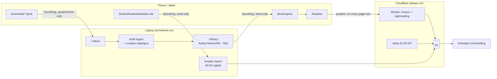

# spine

A self-hosted reading stack. Your own library, on every device, with reading
position synced through your own server and measured reading time on a public page
— and nothing at home that has to stay awake for any of it to work while you read.

- **Reader:** [Readest](https://github.com/readest/readest) on Android and desktop
  (KOReader works too — same protocol, same book identity)
- **Position sync:** a kosync-compatible server on Cloudflare Workers + D1
- **Library delivery:** [Syncthing](https://syncthing.net), laptop → every device
- **Ingest:** a pipeline that files every book as Author / Series / `NN - Title`,
  with the corrected metadata written into the book itself
- **Stats:** measured reading time from each reader, on
  [kirtanjain.com/reading](https://kirtanjain.com/reading)

## How it fits together



Three deployables, split by **how often each is allowed to be offline** rather than
by what it does:

| Path | Runs | Holds |
|---|---|---|
| `worker/` | Cloudflare, always | The kosync protocol, D1, the public `/api/reading` route, a nightly rollup |
| `laptop/` | Sometimes | `shelf` (ingest + `reconcile`), `kostats` (statistics importer), `mappings/` (the curated catalogue) |
| `site/reading/` | Static | A self-contained page for the public reading view |
| `device/` | By hand | One-command setup for a new Android reader |
| `systemd/` | Laptop | The ingest watcher, the nightly stats import, weekly backups |

## Why

Most self-hosted reading setups put progress sync on the same box as the library.
That box is a laptop or a NAS, and when it's asleep your devices can't sync — which
is exactly when you're out reading on them.

Reading position is a single number. It can't be merged, only chosen. So it belongs
on whatever node you can keep up cheapest, separately from the large, sleepy thing
holding your files. If you already host a site on Cloudflare, you already have that
node: the Worker deploys on routes under your existing domain, and the site itself
doesn't move.

The library is the opposite shape: large, static, and needed *before* you read, not
during. So Syncthing puts every book on every device ahead of time. Opening one
needs no network at all.

## Day to day

**Get a book:** download a DRM-free `.epub` on the phone, or drop any book into
`~/inbox` on the laptop. Within a minute of the laptop being awake it is filed,
tagged, on every device, and in Readest's library.

**Read:** in Readest, on any device. Position follows you through the server, laptop
or no laptop.

**See it:** [kirtanjain.com/reading](https://kirtanjain.com/reading) shows what
you're reading now, what you've finished, and measured time per day. Positions are
live; reading time lands after the nightly import.

**Something didn't show up:** it's in `~/quarantine/<reason>/` — usually another
edition of a book you already own, which the pipeline refuses to publish beside the
first. `uv run shelf status` in `laptop/` has the counts.

**A series has no numbers:** add it to `laptop/mappings/series.json` and run
`uv run shelf reconcile --apply`. New books pick the mapping up at ingest.

## Features

- **Stock kosync protocol** — unmodified KOReader and Readest both work
- Per-device progress rows, so conflicts are visible rather than silently resolved;
  switchable conflict policy (`newest` or `furthest`)
- Finished detection on push, with a guard for Readest's first-open 100%
- **A curated catalogue applied into the files:** author aliases, per-book fixes and
  series orders in `mappings/`, written into each EPUB so a reader that groups by
  embedded metadata sorts correctly. A rewrite changes the book's hash, so every row
  keyed on it moves with it.
- Second editions of owned books are quarantined, not duplicated
- Google Takeout's quirks handled: EPUBs named `.pdf`, EPUBs zipped with their folder
- Measured reading time from Readest and KOReader, with a date cutoff for a fresh start
- A new Android reader in one command, over adb
- Runs comfortably inside Cloudflare's free tier for a single reader

## Setup

### The server

```bash
cd worker
npm install
npx wrangler d1 create spine          # put the database_id in wrangler.jsonc
npx wrangler d1 migrations apply spine --remote
openssl rand -hex 32 | npx wrangler secret put AUTH_PEPPER
npx wrangler deploy
```

The `--remote` flag matters: without it, wrangler applies the migrations to a local
development copy and the deployed Worker sees an empty database, with no error to
say so. The full walkthrough — including the route-precedence check and the WAF
rate-limit rule — is in [DEPLOY.md](DEPLOY.md).

Registration is open only while the `users` table is empty, and closes itself after
the first account. Register **from the reader**, not with curl: the client sends an
MD5 of your password. Readest's *Connect* registers the account if it doesn't exist.

### The laptop

```fish
cd laptop && uv sync && cp .env.example .env
systemd/install.fish                  # ingest watcher, nightly stats, weekly backup
```

See [laptop/README.md](laptop/README.md) and [systemd/README.md](systemd/README.md).

### A reader

```fish
device/setup-android.sh tab-s11       # any short, stable name
```

With the device on adb, the script installs Readest and Syncthing-Fork, grants their
permissions, pairs the device from a QR code, sets up every share on the laptop
side, and then asks for the few taps only the device can make — checking each one.
Readest on the laptop itself is `sudo pacman -S readest` plus two settings. Details,
and the by-hand KOReader notes, are in [docs/DEVICE-SETUP.md](docs/DEVICE-SETUP.md).

### If you fork this

None of these are secrets — `AUTH_PEPPER` and any D1 token never enter the repo —
but they are specific to one person:

- `worker/wrangler.jsonc` — the `routes` hostnames, `database_id`, and the cron
  (set for 01:00 IST)
- `worker/src/time.ts` — `IST_OFFSET_SECONDS`, if you do not read in India
- `laptop/mappings/` — the catalogue is one person's library
- `site/reading/index.html` — the standfirst

## Published files

A book's identity is a partial MD5 of its contents, and every position, session and
finish is keyed on it. So files are never changed casually: everything the pipeline
does happens before a book is published, including writing the curated metadata in.

The one sanctioned exception is `shelf reconcile`, which rewrites a file only when
the catalogue disagrees with it, and then moves every hash-keyed row (`progress`,
`sessions`, `book_status`, `book_stats`) to the new hash and verifies the write by
reading it back. Anything else that rewrites a published book — a library server
"helpfully" saving metadata, a manual re-tag — silently forks it.

## Provenance, or: not lying to yourself

Every session row declares where it came from:

| Column | Values |
|---|---|
| `source` | `readest`, `koreader`, and for imported history `kavita`, `playbooks`, `wellbeing` |
| `confidence` | `exact`, `approx`, `inferred` |
| `method` | which model produced an inferred row |

`confidence` is in the primary key of every aggregate table, so no query can sum
measured and modelled time by accident. Reconstructed history is seductive, and a
lifetime-hours figure that silently mixes measurement with estimation is worse than
having no figure at all.

## Things that bit, so they won't bite you

- **Google Takeout names most EPUBs `.pdf`,** and calibre's `ebook-meta` picks its
  reader by extension — it returns the filename as the title and "Unknown" as the
  author. 67 books sat under Unknown Author before anyone noticed.
- **The test suite reached production.** Unsetting the Cloudflare token isn't
  enough when a client falls back to the logged-in `wrangler` session. Tests now run
  with `SPINE_D1=off` and never read `laptop/.env`.
- **Readest pushes 100% when a book first opens** — `(page + 1) / totalPages` while
  `totalPages` is still 1. The server undoes a finish that reverses within minutes.
- **Syncthing-Fork enables file versioning by default,** and Readest then tries to
  import the old copies from `.stversions/`. Turn it off for the library folder.

More, with the reasoning, in [CLAUDE.md](CLAUDE.md).

## Auth is weak, and that's the protocol's fault

kosync authenticates with an MD5 of your password in a header, on every request.
Every implementation inherits this, including this one.

Server-side, spine stores `HMAC-SHA-256(AUTH_PEPPER, key)` rather than the key, and
compares in constant time. It deliberately does not use bcrypt or argon2: a
memory-hard hash on every sync request blows the Workers free-tier CPU budget, and
it would be spent defending a credential the protocol has already capped at unsalted
MD5 in a header. The security model is the one the protocol forces:

**Use a credential you use nowhere else.** The stored hash only needs to survive a
database dump, and a random single-purpose credential survives one fine.

Rate limiting on the auth route is a Cloudflare WAF rule, not Worker code.

## Back it up

The history is the point of the whole exercise. `spine-backup.timer` exports D1
weekly into `~/spine-data/backups`, keeping the last twelve; by hand:

```bash
npx wrangler d1 export spine --remote --output=spine-$(date +%F).sql
```

Always before a schema change or a bulk operation like `shelf reconcile --apply`.

## Status

Built for one reader on a phone, a tablet and a laptop. The protocol implementation
is the stable part; everything around it is opinionated and probably wrong for you
in at least one place.

## Non-goals

- No DRM handling of any kind
- No multi-user, no sharing, no roles
- No library server — the library is plain files, and Syncthing delivers them

## Related

- [Readest](https://github.com/readest/readest) — the reader
- [Syncthing-Fork](https://github.com/researchxxl/syncthing-android) — Syncthing on Android
- [KOReader](https://github.com/koreader/koreader) and
  [koreader-sync-server](https://github.com/koreader/koreader-sync-server), the
  reference implementation of the protocol

## Licence

MIT.
